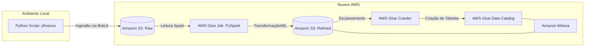

# Tech Challenge - Pipeline de Dados Bovespa (Fase 2)

Este projeto implementa um pipeline de dados fim-a-fim para extração, processamento e análise de ativos da B3 (PETR4 e BOVA11).

##Arquitetura do Projeto
O diagrama abaixo descreve o fluxo de dados desde a extração local até a disponibilização para análise:

##Arquitetura da Solução
A solução utiliza uma arquitetura de Data Lake na AWS dividida em camadas:
- **Extração**: Script Python (`yfinance`) com tratamento de precisão de timestamps para compatibilidade Spark.
- **Armazenamento**: AWS S3 nas camadas `raw/` (dados brutos particionados) e `refined/` (dados processados).
- **Processamento**: AWS Glue Job utilizando PySpark para transformações e cálculo de média móvel.
- **Catálogo**: AWS Glue Crawler para automação do schema no Data Catalog.
- **Consumo**: Amazon Athena para consultas analíticas via SQL.

##Tecnologias Utilizadas
- Python (yfinance, Pandas, Boto3)
- Apache Spark (PySpark)
- AWS Glue, S3, Athena e IAM

##Transformações Implementadas
- Normalização de nomes de colunas.
- Tratamento de tipos de dados (Timestamps).
- Cálculo da **Média Móvel de 7 dias** para análise de tendência.
- Particionamento físico dos dados por Ticker e Data para otimização de performance e custo.
